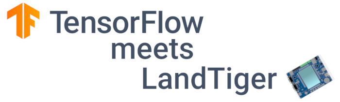

<p align="center">
  
</p>

<p align="center">
    <a href="./LICENSE"></a>
    <a href="https://www.tensorflow.org"></a>
    <a href="https://www.polito.it/"></a>
</p>

# TensorFlow meets LandTiger

> Drawn-number recognition using TensorFlow Lite Micro (TFLM) + MNIST database on LandTiger Development Board.

I developed this project during Computer Architectures course, A.Y. 2020/2021, at Politecnico di Torino with the help of Professor Paolo Bernardi and Assistant Professor Francesco Angione.

This README shows the technical details of the codebase. Take a look at the [blog post I made](http://cas.polito.it/NXP-LANDTIGER@PoliTo-University/) for more information about the project development.


## Table Of Contents

- [Board Specifications](#board-specifications)
- [Project Structure](#project-structure)
- [IDE Configurations](#ide-configurations)
- [Compiler Configurations](#compiler-configurations)
- [Code Size](#code-size)
- [Keil and TensorFlow - Getting Started](#keil-and-tensorflow---getting-started)
- [Known issues](#known-issues)
- [Contributing](#contributing)
- [Authors](#authors)
- [Resources](#resources)
- [Credits](#credits)
- [License](#license)

## Board Specifications

[(Back to top)](#table-of-contents)

- [NXP LPC1768 ARM Cortex-M3 32-bit Microcontroller](https://www.nxp.com/products/processors-and-microcontrollers/arm-microcontrollers/general-purpose-mcus/lpc1700-cortex-m3/512kb-flash-64kb-sram-ethernet-usb-lqfp100-package:LPC1768FBD100)
    - Frequency up to 100 MHz;
    - 512KB on-chip Flash;
    - 64KB SRAM.

- 3.2" 320x240 TFT Color LCD Display
    - LCD Controller: SSD1289;
    - LCD Interface: 16-bit parallel;
    - Touch-Screen Controller: XPT2046/HR2046;
    - Touch-Screen Interface: SPI;
    - Colors: 65536;
    - LED backpanel illumination.

Programming and debugging has been done using ULINK2 Debug Adapter through JTAG interface.

## Project Structure

[(Back to top)](#table-of-contents)

- `./main.c`: application entry point;

- `./tensortiger.c`: functions to draw application interface on the display and manage TensorFlow;

- `GLCD/`: function library for LCD;

- `TouchPanel/`: function library for Touch-Screen;

- `timer/`: function library for system Timers;

- `icons/`: images and icons converted to C source-file and used in the application (thanks to [Gianni Cito](http://cas.polito.it/NXP-LANDTIGER@PoliTo-University/?p=81));

- `CMSIS/`: collection of CMSIS (Common Microcontroller Software Interface Standard) kernel/operations optimized for ARM Cortex-M processors, including NN-specific, functions;

- `tensorflow/`: part of official TensorFlow library, specific for microcontrollers (TensorFlow Lite Micro);
    - `tensorflow/lite/micro/examples/hello_world/model.cc`: trained model of the NN;
    - `tensorflow/lite/micro/examples/hello_world/main_functions.cc`: setup and inference function of the NN;

- `third_party/`: third-party libraries used by TensorFlow (flatbuffers, ruy, gemmlowp);

- `Listings/`: listing files;

- `Objects/`: executable and object files generated by building the project.

## IDE Configurations

[(Back to top)](#table-of-contents)

**IDE: Keil MDK uVision v5.33.0.0**

- Run-Time Environment (RTE):
    - Compiler
        - I/O
            - [x] STDERR -> Breakpoint
            - [x] STDIN -> ITM
            - [x] STDOUT -> User

*N.B. `stdout_user.c` is the implementation of RTE configuration.*

## Compiler Configurations

[(Back to top)](#table-of-contents)

**Compiler: ARM Compiler V6.15 (armclang) - C99 and C++11 standards**

### Optimizations

- `One ELF Section per Function`: write one ELF section for each function, removing unusued functions;

- `-Oz image size`: optimize for code size, instead of performance;

- `Link-Time Optimization`: perform aggressive optimization further reducing code size and increasing performance but compromise debugging [optional, disabled by default].

### Pre-processor symbols

```
ARM_MATH_CM3
CMSIS_NN
SIMULATOR
```

### Include paths

```
.;
third_party/gemmlowp;
third_party/flatbuffers/include;
third_party/ruy;
third_party/kissfft;
CMSIS/Core/Include;
CMSIS/DSP/Include;
CMSIS/NN/Include;
CMSIS/NN/Source
```

## Code Size

[(Back to top)](#table-of-contents)

### Without any Optimization (excluding `One ELF Section per Function`)

|                  | Code   | Read-Only Data | Read-Write Data | Zero-Initiated Data | Total RAM | Total ROM |
| :--------------- | -----: | -------------: | --------------: | ------------------: | --------: | --------: |
| **Size [bytes]** | 426564 |          57976 |           11904 |               18484 |     30388 |    496444 |

### After -Oz Optimization

|                  | Code   | Read-Only Data | Read-Write Data | Zero-Initiated Data | Total RAM | Total ROM |
| :--------------- | -----: | -------------: | --------------: | ------------------: | --------: | --------: |
| **Size [bytes]** | 247740 |          52512 |           11904 |               18484 |     30388 |    312156 |
| **Improvement**  | -41.9% |          -9.4% |               - |                   - |         - |    -37.1% |

### After -Oz and Link-Time Optimization

|                  | Code   | Read-Only Data | Read-Write Data | Zero-Initiated Data | Total RAM | Total ROM |
| :--------------- | -----: | -------------: | --------------: | ------------------: | --------: | --------: |
| **Size [bytes]** | 222084 |          52476 |           11852 |               18484 |     30336 |    286412 |
| **Improvement**  | -47.9% |          -9.5% |           -0.4% |                   - |     -0.2% |    -42.3% |

```
Total RAM Size = RW Data + ZI Data
Total ROM Size = RW Data + RO Data + Code
```

## Keil and TensorFlow - Getting Started

[(Back to top)](#table-of-contents)

**TensorFlow library v2.5.0**\
**CMSIS kernel v5.7.0**

1. Generate a Keil sample project with TensorFlow, including CMSIS
    ```
    $ git clone https://github.com/tensorflow/tensorflow.git
    $ cd tensorflow
    $ make -f tensorflow/lite/micro/tools/make/Makefile OPTIMIZED_KERNEL_DIR=cmsis_nn generate_hello_world_keil_project
    $ cp -r tensorflow/lite/micro/tools/make/gen/linux_x86_64_default/prj/hello_world/keil/tensorflow/lite/micro/tools/make/downloads/cmsis/CMSIS tensorflow/lite/micro/tools/make/gen/linux_x86_64_default/prj/hello_world/keil
    ```

2. Open `keil_project.uvprojx` inside `tensorflow/lite/micro/tools/make/gen/linux_x86_64_default/prj/hello_world/keil/` and modify Target device from STM32F746 to NXP-LPC1768;

3. Adjust [compiler configurations](#compiler-configurations) and check `Use Memory Layout from Target Dialog` option inside 'Linker' tab;

4. [Model creation in Keras + model conversion with int8 quantization](https://github.com/iwatake2222/pico-mnist/blob/master/pj_mnist/conv_mnist/tflmicro_mnist.ipynb);

5. Modify `kTensorArenaSize` inside `tensorflow/lite/micro/examples/hello_world/main_functions.cc` according to `arena_used_bytes()` function;\
    N.B. Tensor Arena is used to statically load the model inside the interpreter of TFLM. [The optimal size is arena_used_bytes() + 16 bytes for alignment](https://github.com/tensorflow/tensorflow/commit/298b24151e18c36906afd17e16524e79b4468ffd).

6. Rename `tensorflow/lite/micro/testing/micro_test.h(89)` function from `main()` to `test()`;

7. Add custom Startup files for LPC1768 to project root folder: `system_LPC17xx.c`, `startup_LPC17xx.s`, `core_cm3.c`;

8. [optional] Remove `main.cc` from Keil project and add a custom one.

## Known issues

[(Back to top)](#table-of-contents)

- Unlike what happens with the rest of numbers, recognition of particular ones (6, 7, 9) does not perform well with particular ways of draw them. This is probably due to the model training (poor dataset size and/or data bias, poor training) and to the addional model quantization, required for maintaining low model size. A possible solution is to [re-train the NN and create a more accurate model](https://www.tensorflow.org/lite/performance/model_optimization#types_of_optimization).

## Contributing

[(Back to top)](#table-of-contents)

Suggestions and improvements [are welcome](https://github.com/robymontyz/tensorflow_meets_landtiger/issues).

Styles used:

- Versioning system standard: [Semantic Versioning](http://semver.org/)

- Commit messages standard: [Conventional Commits](https://www.conventionalcommits.org/en/v1.0.0/)

## Authors

[(Back to top)](#table-of-contents)

- Roberto A. - [](https://github.com/robymontyz) - [](https://twitter.com/robymontyz)

## Resources

[(Back to top)](#table-of-contents)

- [LandTiger manual](./docs/03_landtiger_v2.0_-_manual__v1.1.pdf)
- [LandTiger schematic](./docs/04_HY-LandTiger_SCH.pdf)
- [Display manual](./docs/06_ILI9325_LCD_controller.pdf)
- [Display schematic](./docs/05_HY32D_display_SCH.pdf)
- [Touchscreen manual](./docs/07_ads7843_touchscreen_controller.pdf)

## Credits

[(Back to top)](#table-of-contents)

- Prof. P. Bernardi

- Assistant Prof. F. Angione

- [How to Implement Digit Recognition with TensorFlow Lite using an i.MX RT1060 Crossover MCU](https://www.allaboutcircuits.com/industry-articles/how-to-implement-digit-recognition-with-tensorflow-lite-using-an-i.mx-rt1060-crossover-mcu/)

- [pico-mnist by iwatake2222](https://github.com/iwatake2222/pico-mnist)

- [MNIST-TFLite by frogermcs](https://github.com/frogermcs/MNIST-TFLite)

- [tfmicro by recognition2](https://github.com/recognition2/tfmicro)

- [Creating a Graphics Interface handling Images, Buttons and Drawing functionalities on LandTiger](http://cas.polito.it/NXP-LANDTIGER@PoliTo-University/?p=81)

- [TensorFlow Lite for Microcontrollers Documentation](https://www.tensorflow.org/lite/microcontrollers)

- [TensorFlow 8-bit quantization](https://www.tensorflow.org/lite/performance/quantization_spec)

- [TensorFlow official library](https://github.com/tensorflow/tensorflow)

- [Stand-alone TensorFlow Lite Micro official library](https://github.com/tensorflow/tflite-micro)

- [CMSIS official library](https://github.com/ARM-software/CMSIS_5)

- [LandTiger rendering by Gabriele Filipponi](http://cas.polito.it/gitlab/nxp-landtiger/landtiger-emulation/emulator-v01/blob/1121f5c11048d8280842b4dbf554e8dedf5c3ee9/board.bmp)

## License

[(Back to top)](#table-of-contents)

The TensorFlow source code is covered by the license described [here](https://github.com/tensorflow/tensorflow/blob/master/LICENSE), components from other libraries have the appropriate licenses included in their `third_party` folders.\
TensorFlow, the TensorFlow logo and any related marks are trademarks of Google Inc.\
[Roboto font family](https://fonts.google.com/specimen/Roboto) is licensed under the Apache License, Version 2.0.\
CMSIS license is [here](https://github.com/ARM-software/CMSIS_5/blob/develop/LICENSE.txt).\
This project is licensed and distributed under the [GNU General Public License v3.0](https://www.gnu.org/licenses/gpl.html) (**GPLv3**) - see the [LICENSE](./LICENSE) file for details.

-----

<p align="center">
    </a>
</p>
